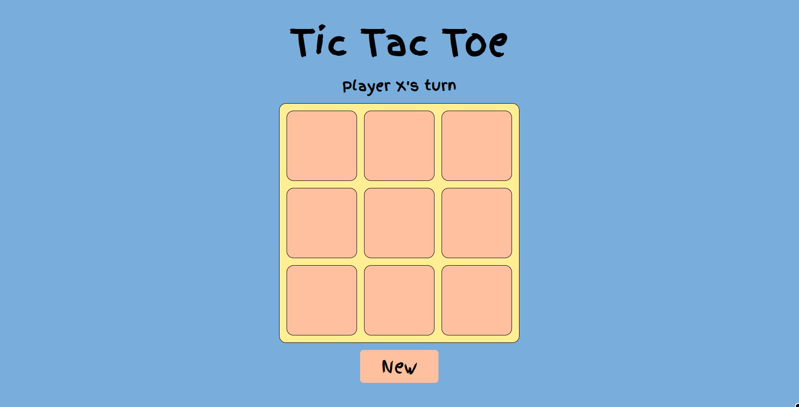

# Tic-Tac-Toe 

---

A sleek, lightweight, and intuitive implementation of the classic Paper-and-Pencil game. Whether you're looking to challenge a friend or test out some game logic, this project has you covered.
🚀 Features

- Two-Player Mode: Play locally with a friend.

- Win Detection: Automatically identifies horizontal, vertical, and diagonal wins.

- Draw Logic: Recognizes when the board is full with no winner.

- Responsive Design: Looks great on desktops and mobile browsers (if web-based).

- State Management: Highlighting the winning combination for clarity.

---

